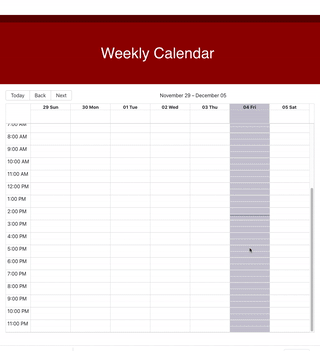

<h1 align="center">Welcome to calendar-app 👋</h1>
<p>
  <a href="https://www.npmjs.com/package/calendar-app" target="_blank">
    
  </a>
</p>

## Technologies

Project is created with:

- React
- React Bootstrap

## Demo



## Setup

To run this project, install it locally using npm:

```sh
npm install
```

## Usage

##### First

To store data in a json file `db.json` server run:

```sh
json-server --watch db.json
```

##### Second

To view app locally in your browser run:
\*You will be asked if you want to run it on another port, choose yes.

```sh
npm start
```

## Author

👤 **Liz Kipp**

- Website: https://www.lizkipp.me/
